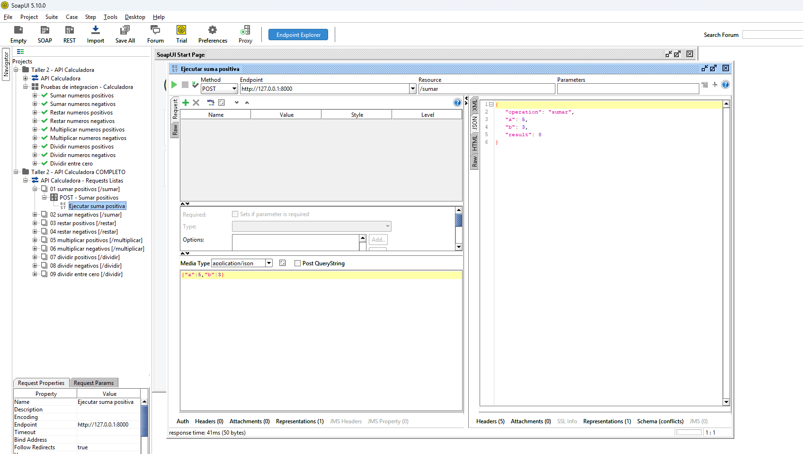

# Taller 2 - API Calculadora con FastAPI

Este proyecto implementa una calculadora básica en Python usando FastAPI y pruebas automatizadas con pytest.

## Estructura

```text
app/
  calculator.py  # lógica de negocio
  main.py        # API REST con FastAPI
tests/
  test_calculator.py  # pruebas unitarias
  test_api.py         # pruebas de API/integración con TestClient
```

## Instalación

```bash
python -m venv .venv
.venv\Scripts\activate
pip install -r requirements.txt
```

## Ejecutar la API

```bash
uvicorn app.main:app --reload
```

La documentación interactiva queda disponible en:

- http://127.0.0.1:8000/docs
- http://127.0.0.1:8000/redoc

## Endpoints

Todos los endpoints reciben un JSON con dos números:

```json
{
  "a": 5,
  "b": 3
}
```

Operaciones disponibles:

- `POST /sumar`
- `POST /restar`
- `POST /multiplicar`
- `POST /dividir`

Ejemplo de respuesta:

```json
{
  "operation": "sumar",
  "a": 5,
  "b": 3,
  "result": 8
}
```

Si se intenta dividir entre cero, la API responde con código `400`.

## Ejecutar pruebas con pytest

```bash
pytest
```

Las pruebas incluidas cubren:

- Suma con números positivos, negativos y cero.
- Resta con números positivos, negativos y cero.
- Multiplicación con números positivos, negativos y cero.
- División con números positivos, negativos, decimales y división entre cero.
- Validación de endpoints de la API.
- Validación de error cuando se envía un valor no numérico.

## Pruebas con SOAPUI

Para las pruebas de integración se usó SOAPUI apuntando a la API local en `http://127.0.0.1:8000`. La API debe estar encendida antes de ejecutar los casos:

```bash
uvicorn app.main:app --reload
```

El proyecto de SOAPUI se preparó mediante un archivo XML local que define el servicio REST, los recursos de la calculadora y los casos de prueba. Ese XML contiene las peticiones configuradas con método `POST`, `Content-Type: application/json`, endpoint `http://127.0.0.1:8000` y los cuerpos JSON correspondientes para cada operación. La carpeta local `soapui/` no se incluye en el repositorio porque es material de configuración de la herramienta, no código fuente de la API.

Evidencia de ejecución en SOAPUI:



Pruebas configuradas en el XML de SOAPUI:

| Operación | Método | URL | Body esperado |
| --- | --- | --- | --- |
| Sumar positivos | POST | `/sumar` | `{"a": 5, "b": 3}` |
| Sumar negativos | POST | `/sumar` | `{"a": -5, "b": -3}` |
| Restar positivos | POST | `/restar` | `{"a": 10, "b": 4}` |
| Restar negativos | POST | `/restar` | `{"a": -10, "b": -4}` |
| Multiplicar positivos | POST | `/multiplicar` | `{"a": 6, "b": 7}` |
| Multiplicar negativos | POST | `/multiplicar` | `{"a": -6, "b": -7}` |
| Dividir positivos | POST | `/dividir` | `{"a": 20, "b": 5}` |
| Dividir negativos | POST | `/dividir` | `{"a": -20, "b": -5}` |
| Dividir entre cero | POST | `/dividir` | `{"a": 20, "b": 0}` |

La prueba de **sumar positivos** envía `5` y `3` al endpoint `/sumar` y valida que la API responda con resultado `8`.

La prueba de **sumar negativos** envía `-5` y `-3` al endpoint `/sumar` y valida que la API responda con resultado `-8`.

La prueba de **restar positivos** envía `10` y `4` al endpoint `/restar` y valida que la API responda con resultado `6`.

La prueba de **restar negativos** envía `-10` y `-4` al endpoint `/restar` y valida que la API responda con resultado `-6`.

La prueba de **multiplicar positivos** envía `6` y `7` al endpoint `/multiplicar` y valida que la API responda con resultado `42`.

La prueba de **multiplicar negativos** envía `-6` y `-7` al endpoint `/multiplicar` y valida que la API responda con resultado `42`.

La prueba de **dividir positivos** envía `20` y `5` al endpoint `/dividir` y valida que la API responda con resultado `4`.

La prueba de **dividir negativos** envía `-20` y `-5` al endpoint `/dividir` y valida que la API responda con resultado `4`.

La prueba de **dividir entre cero** envía `20` y `0` al endpoint `/dividir` y valida que la API controle el error devolviendo una respuesta `400` con el mensaje `No se puede dividir entre cero`.

## Pruebas E2E con Serenity BDD

Serenity BDD normalmente se implementa como un proyecto aparte, por ejemplo en Java, consumiendo esta API como sistema bajo prueba.

Escenarios sugeridos:

- Como usuario, quiero sumar dos números positivos y ver el resultado correcto.
- Como usuario, quiero sumar dos números negativos y ver el resultado correcto.
- Como usuario, quiero restar dos números y ver la diferencia correcta.
- Como usuario, quiero multiplicar dos números y ver el producto correcto.
- Como usuario, quiero dividir dos números y ver el cociente correcto.
- Como usuario, quiero recibir un error claro si intento dividir entre cero.

## Conclusión

Las pruebas unitarias validan la lógica de la calculadora. Las pruebas de API con pytest validan que FastAPI reciba solicitudes y devuelva respuestas correctas. SOAPUI y Serenity BDD sirven para generar evidencia externa desde la perspectiva de integración y flujo completo.
